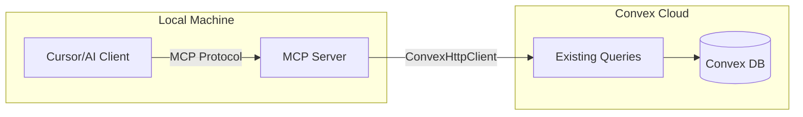

# MCP Server for markdown-site

Add MCP server capability so this blog can serve as a content source for AI tools like Cursor. When users fork the repo, they can run their own MCP server connected to their Convex deployment.

## Architecture



## Files to create

### 1. MCP Server Script

Create `scripts/mcp-server.ts`

- Connects to Convex using `ConvexHttpClient` (same pattern as `scripts/sync-posts.ts`)
- Implements MCP protocol via stdio transport
- Exposes tools that wrap existing Convex queries:
  - `list_posts` calls `api.posts.getAllPosts`
  - `get_post` calls `api.posts.getPostBySlug`
  - `list_pages` calls `api.pages.getAllPages`
  - `get_page` calls `api.pages.getPageBySlug`
  - `search_content` calls `api.search.search`
  - `export_all` returns all posts with full content

### 2. Package updates

Update `package.json`

- Add dependency: `@modelcontextprotocol/sdk`
- Add script: `"mcp": "tsx scripts/mcp-server.ts"`

## Files to update

### 3. Documentation

Update `README.md` with MCP Server section:
- How to start the MCP server
- Cursor configuration example
- Available tools list

Update `content/pages/docs.md` with MCP documentation

Update `files.md` with new script description

Update `changelog.md` with new feature

## MCP Tools specification

| Tool | Description | Convex Query |
|------|-------------|--------------|
| `list_posts` | Get all published posts | `api.posts.getAllPosts` |
| `get_post` | Get post by slug | `api.posts.getPostBySlug` |
| `list_pages` | Get all published pages | `api.pages.getAllPages` |
| `get_page` | Get page by slug | `api.pages.getPageBySlug` |
| `search_content` | Full text search | `api.search.search` |
| `export_all` | Batch export all content | Multiple queries |

## User workflow after fork

```bash
# Install dependencies
npm install

# Start MCP server (reads VITE_CONVEX_URL from .env.local)
npm run mcp
```

Cursor config (`~/.cursor/mcp.json`):
```json
{
  "mcpServers": {
    "my-blog": {
      "command": "npm",
      "args": ["run", "mcp"],
      "cwd": "/path/to/blog",
      "env": {
        "VITE_CONVEX_URL": "https://deployment.convex.cloud"
      }
    }
  }
}
```

## Security

- Read-only access only (no mutations exposed)
- Uses existing Convex queries (same access as public API)
- Each user runs their own MCP server locally
- No authentication needed (blog content is public)

## Implementation todos

1. Add `@modelcontextprotocol/sdk` dependency to package.json
2. Create `scripts/mcp-server.ts` with MCP protocol implementation
3. Add `mcp` script to package.json
4. Add MCP Server section to README.md
5. Add MCP documentation to content/pages/docs.md
6. Add mcp-server.ts to files.md
7. Add MCP feature to changelog.md

